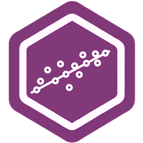

Cursos que imparto en el pregrado de Sociología de la **Universidad Diego Portales**. Todos los materiales son de libre acceso a través de los sitios de cada versión.

::: {.teaching}
## Análisis Avanzado de Datos II (SOC9035)

::: columns
::: {.column width="15%"}
{width=80 alt="Logo del curso Análisis Avanzado de Datos II"}
:::
::: {.column width="85%"}
**Versiones:** [2026](https://gabrielsotomayorl.github.io/aadii/2026/index.html), [2025](https://aadii2025.netlify.app/), [2024](https://aadii2024.netlify.app/), [2023](https://aadii2023.netlify.app/)

Curso orientado al modelamiento de estructuras latentes en ciencias sociales. La secuencia central avanza desde el análisis factorial exploratorio y confirmatorio hacia el análisis de senderos y los modelos de ecuaciones estructurales (SEM). Integra además contenidos de ciencia abierta, investigación reproducible y análisis de encuestas complejas en *R*.
:::
:::

## Descripción y Visualización de Datos (SOC09124)

::: columns
::: {.column width="15%"}
{width=80 alt="Logo del curso Descripción y Visualización de Datos"}
:::
::: {.column width="85%"}
**Versiones:** [2025](https://dyv25.netlify.app/)

Curso introductorio que desarrolla la capacidad de pensar con datos desde una perspectiva sociológica. Cubre estadística descriptiva, manejo de datos y visualización en *R*, avanzando desde el análisis univariado hasta las primeras herramientas bivariadas, con énfasis en la interpretación sustantiva y la visualización como forma de argumentación.
:::
:::

## Análisis Avanzado de Datos I (SOC8224)

::: columns
::: {.column width="15%"}
{width=80 alt="Logo del curso Análisis Avanzado de Datos I"}
:::
::: {.column width="85%"}
**Versiones:** [2024](https://aadi2024.netlify.app/)

Introducción al modelamiento estadístico en ciencias sociales. Desarrolla una progresión desde la regresión lineal simple hasta la regresión logística, el análisis de conglomerados y una introducción al análisis factorial, con énfasis en la interpretación sustantiva y el diagnóstico de modelos en *R*.
:::
:::

## Guía de Tesis (Seminario de Grado)

Participo como docente guía en los Seminarios de Grado I y II de la carrera de Sociología UDP (2024, 2026), acompañando a estudiantes en el diseño y desarrollo de investigaciones empíricas originales para la obtención de la Licenciatura en Sociología.

:::
